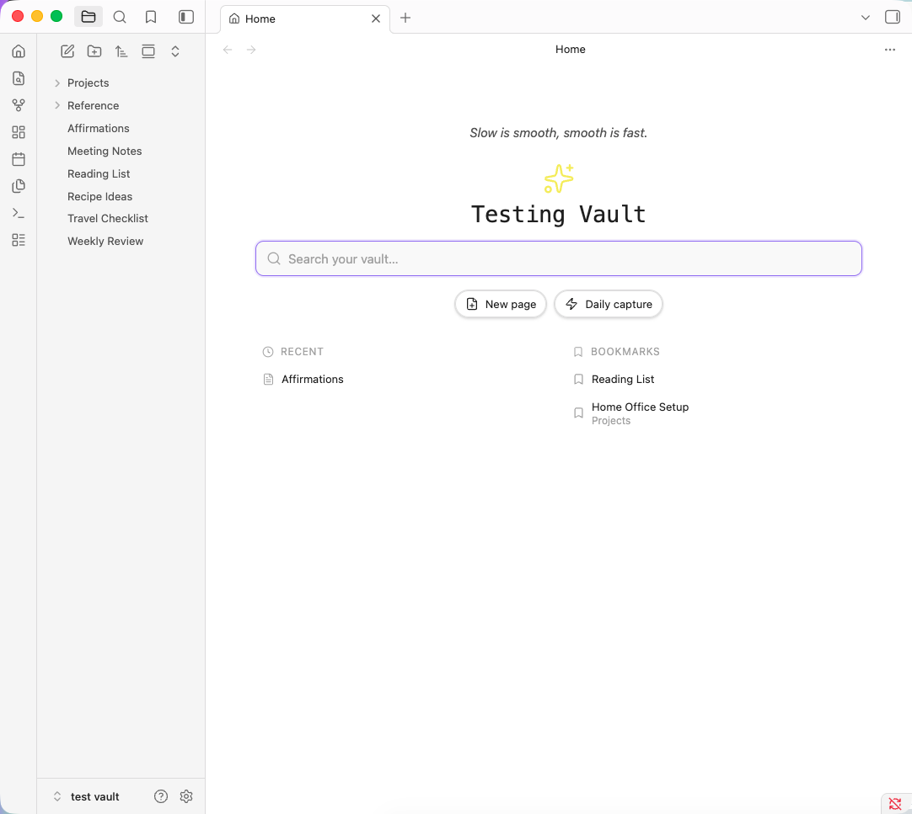
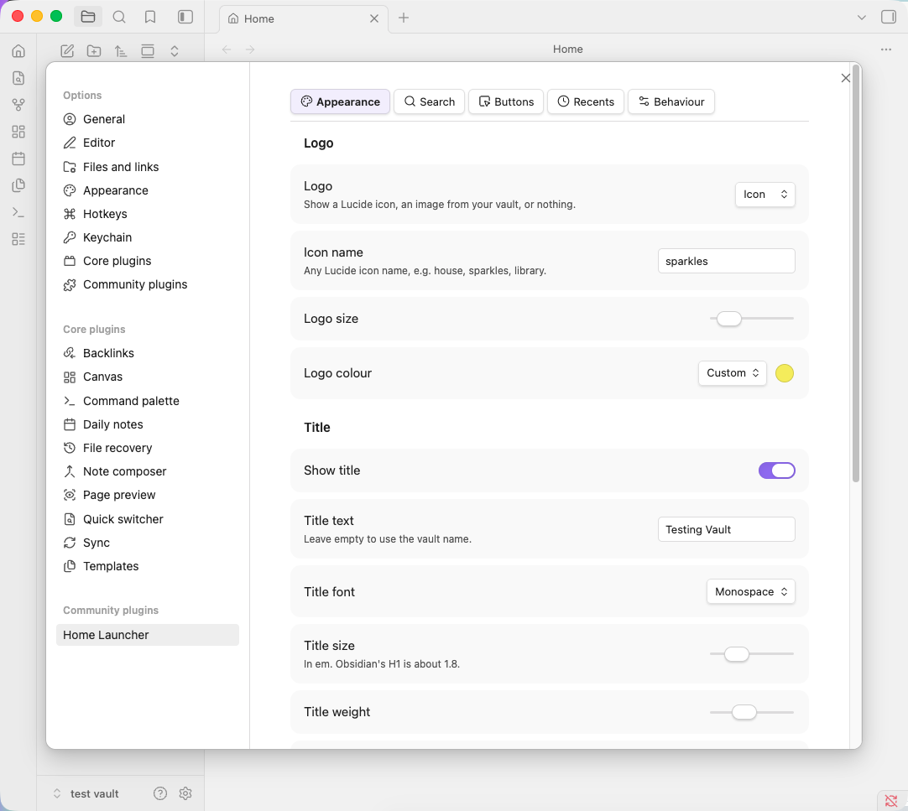

# Home Launcher

Replaces new tabs in [Obsidian](https://obsidian.md) with a home page you compose: a fast
search across your whole vault, buttons you define yourself, and your recent files and
bookmarks.



## Why

Most home page plugins give you a fixed set of blocks. Adding a button means waiting for the
author, or bolting a second plugin onto the first. Home Launcher treats buttons as data — you
add, reorder, hide and configure them in settings, and each one can create a page, run any
command, open a file, reveal a folder, run a search, or open a URL.

## Features

### Search

Matches file names, paths, aliases, headings, tags, and note contents. Every result explains
itself: the note's H1, the section heading the match sits under, an excerpt of the matching
line, the folder it lives in, and how many times your terms appear.

- Names, aliases, headings and tags resolve instantly from the metadata cache
- Note contents are scanned in the background, so you never wait on a body search to see an
  obvious filename hit
- Optional unresolved links — select one to create the note
- Self-contained; no dependency on any other search plugin
- Keyboard driven: `↑ ↓` to navigate, `↵` to open, `Ctrl/Cmd ↵` for a new tab, `Esc` to clear

### Buttons

Define your own. Each has a label, any Lucide icon, and one action:

| Action | What it does |
| --- | --- |
| Create new page | Makes and opens a note, optionally in a set folder |
| Quick capture | Appends a line to today's daily note or a file you choose |
| Run a command | Any command in your vault, picked from a dropdown |
| Open a file | Jumps straight to a note |
| Reveal a folder | Shows a folder in the file explorer |
| Run a search | Opens core search with a saved query |
| Open a URL | Any `http` or `https` link |

Buttons can be reordered, and hidden without deleting them. Three styles: pill, icon-only, or
card grid.

### Quick capture

Appends to today's daily note, following your existing Daily Notes settings for folder, date
format and template. Optionally targets a named heading, adding entries at the end of that
section so they stay in order. Or point it at any single file instead.

Supports `{{text}}`, `{{time}}` and `{{date}}` in the line format.

### Quote of the day

Point at a note holding quotes or affirmations and one appears above your title, in italic.
One a day, or random on every open — click to step to the next either way.

The file can be written however you like: one per line, `-` bullets, `>` blockquotes, or
longer entries separated by a `---` rule. Headings and frontmatter are ignored. End a line
with ` — Author` for attribution.

### Recent files and bookmarks

Recents are tracked as you open notes. Bookmarks come from Obsidian's core Bookmarks plugin.
Both rows support hover preview through the core Page preview plugin, which you can toggle on
or off for this plugin specifically under **Settings → Page preview**.

## Settings

Grouped into five tabs — Appearance, Search, Buttons, Recents, Behaviour — rather than one
long scroll. Logo, title, colours, fonts, result counts, search scope, startup behaviour and
new-tab replacement are all configurable.



## Installation

### From the community plugins list

Settings → Community plugins → Browse → search for "Home Launcher" → Install → Enable.

### Manual

Download `main.js`, `manifest.json` and `styles.css` from the
[latest release](../../releases/latest) and drop them into
`<your vault>/.obsidian/plugins/home-launcher/`, then reload Obsidian and enable the plugin.

## Development

```bash
npm install
npm run dev
```

`npm run dev` starts esbuild in watch mode. Set `OBSIDIAN_PLUGIN_DIR` to build straight into a
vault:

```bash
OBSIDIAN_PLUGIN_DIR="/path/to/vault/.obsidian/plugins/home-launcher" npm run build
```

## What it accesses, and why

- **Reads your file list.** Search has to know what exists, so it enumerates file paths
  through Obsidian's own vault API. This is what powers matching on names, paths, aliases,
  headings and tags.
- **Reads note contents.** Only when content search is on, and only to find your search terms
  and build the excerpt shown in the result. Large files are skipped to keep typing responsive.
- **Writes only when you ask.** Creating a page, quick capture, and creating a note from an
  unresolved link. Nothing is written in the background.

**Nothing leaves your vault.** There are no network requests, no telemetry, no analytics, and
no external services. Search runs entirely locally and does not depend on any other plugin.
The only thing that opens a URL is a button you configured to do exactly that.

## Credits

Built by [SoulBits](https://github.com/SoulBits-Vibe) with [Claude Code](https://claude.com/claude-code).

## License

[MIT](LICENSE)
